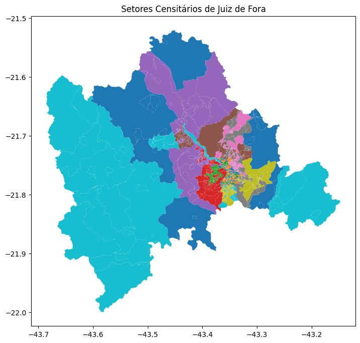
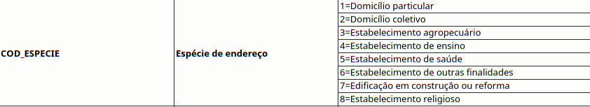
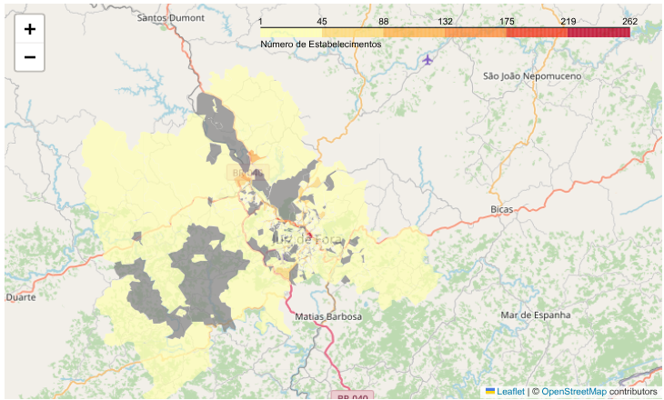
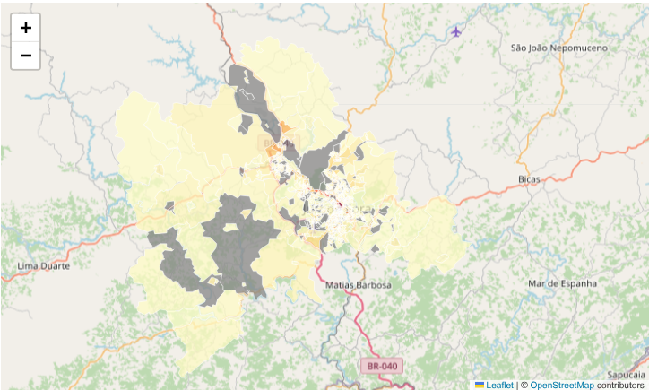
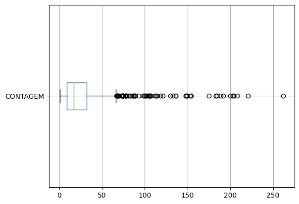
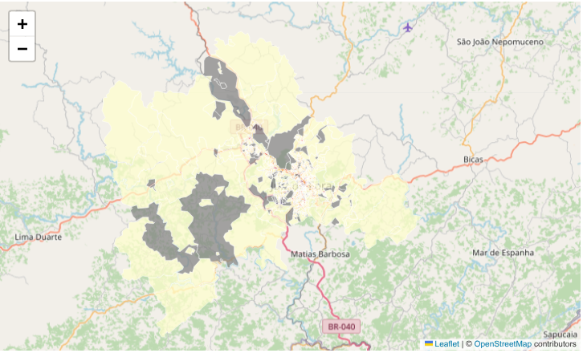
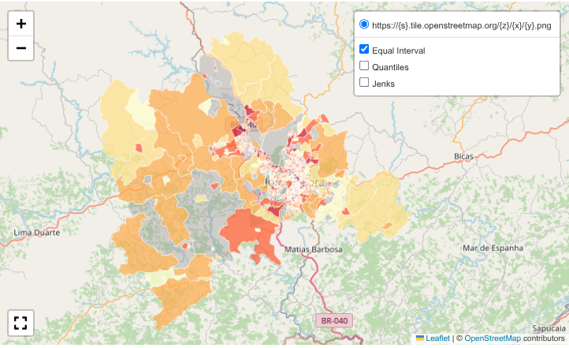
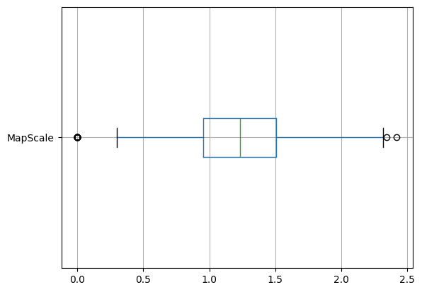
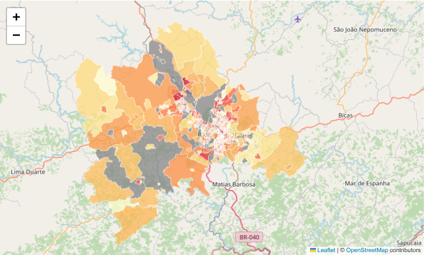
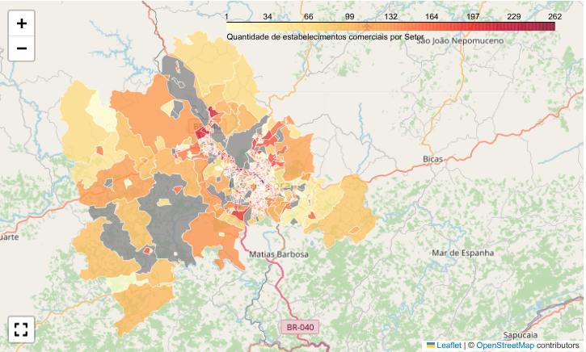

# Métodos de classificação para mapas temáticos

### Introdução

mapa *coroplético* é um tipo de mapa temático que utiliza gradientes de cores para representar dados normalizados - como densidades, razões, taxas e proporções - em diferentes regiões geográficas. O termo tem origem no grego antigo: *χῶρος* (*khôros*), que significa "área, região" e *πλῆθος* (*plêthos*), que significa "multidão".

Existem diversos métodos para classificar os dados em mapas coropléticos, cada um com vantagens e desvantagens específicas. O quadro a seguir resume as características dos métodos mais utilizados:


| Aspecto              | Intervalos Iguais | Quantis | Quebras Naturais |
|----------------------|-------------------|---------|------------------|
| **Definição** | Divide a amplitude dos dados em intervalos iguais | Divide os dados em números iguais de pontos de dados | Encontra agrupamentos naturais baseados na distribuição dos dados |
| **Aplicação** | Adequado para dados com distribuição uniforme | Útil para reduzir o impacto de valores extremos | Eficaz para dados altamente assimétricos |
| **Sensibilidade a Extremos** | Pode não representar bem a distribuição dos dados | Ajuda a mitigar o impacto de outliers | Ajusta os intervalos em torno de clusters naturais |
| **Contagem de Classes** | Os intervalos podem resultar em tamanhos de classe desiguais | Os tamanhos das classes podem variar dependendo dos dados | Tendencia a criar classes com contagens variadas |
| **Dispersão dos Dados** | Pode não refletir a variabilidade dos dados | Pode capturar a variabilidade dos dados | Considera a distribuição dos dados para os intervalos de classe |
| **Interpretabilidade** | Simplista, fácil de entender | Pode obscurecer a distribuição dos dados | Reflete os padrões subjacentes dos dados |
| **Visualização** | Pode não capturar nuances nos dados | Pode não representar bem os dados visualmente | Reflete o agrupamento de dados visualmente |
| **Tomada de Decisão** | Decisões menos informadas devido aos intervalos iguais | Pode não revelar padrões sutis | Revela grupos inerentes aos dados |


### Objetivo

O presente estudo visa conhecer diferentes métodos de classificação e técnicas de criação de mapas temáticos.

Para demonstrar essa técnica cartográfica e seus métodos de classificação, utilizaremos dados do Censo 2022 do Cadastro Nacional de Endereços para Fins Estatísticos. Os dados serão agregados por setores censitários do município de Juiz de Fora/MG.

Para visualização, utilizaremos o **Folium**, pacote Python que cria mapas interativos usando a biblioteca JavaScript Leaflet.js. Sua principal vantagem é permitir a manipulação de dados em Python e visualizá-los diretamente em mapas do *Leaflet*, sem a necessidade de programar em *JavaScript*.

As metas de aprendizagem incluem:

- Extração dos shapefiles setoriais
- Filtragem do município de Juiz de Fora
- Cálculo de densidades (estabelecimentos/km²)
- Aplicação dos métodos de classificação
- Geração dos mapas comparativos

### Coleta de dados

Para a realização deste estudo, foram utilizados dois conjuntos de dados oficiais do Instituto Brasileiro de Geografia e Estatística (IBGE). A base territorial foi definida pela malha de setores censitários do Censo 2022, cujos arquivos shapefile podem ser acessados e baixados diretamente no portal do IBGE. Os dados estatísticos propriamente ditos foram extraídos do Cadastro Nacional de Endereços para Fins Estatísticos (CNEFE), também referente ao Censo 2022, disponível para download em seção específica do mesmo portal institucional.

Devido às limitações computacionais, implementamos estratégias de otimização no carregamento e processamento dos dados.

O roteiro completo para download manual dos arquivos está disponível [aqui](https://github.com/guiajf/igrejas).

### Importamos as bibiotecas


```python
import json
import geopandas as gpd
import branca.colormap as cm
import matplotlib.pyplot as plt
import pandas as pd
import numpy as np
import zipfile
import folium
from jenkspy import jenks_breaks
from folium.plugins import MarkerCluster, Fullscreen
from tqdm import tqdm  # Para barra de progresso (opcional)
import os
import re
import math

```

### Shapefile do município

Um shapefile (.shp) é um arquivo digital que contém a representação geográfica vetorial dos limites territoriais oficiais de um município brasileiro, conforme definido pelo IBGE. Esse formato, amplamente utilizado em Sistemas de Informação Geográfica, armazena dados espaciais e atributos associados (como nome, código IBGE, área, etc.).

### Visualizamos o shapefile


```python
# Configurações
COD_MUNICIPIO = '3136702'
PATH_ZIP = "MG_setores_CD2022.zip"
PATH_EXTRACTED = "MG_setores_CD2022"
PATH_OUTPUT = "JF_setores"
MAX_FEATURES = 5000  # Limite máximo de features para carregar (ajuste conforme sua RAM)

# Extração otimizada
if not os.path.exists(PATH_EXTRACTED):
    print("Descompactando arquivo ZIP...")
    with zipfile.ZipFile(PATH_ZIP, 'r') as zip_ref:
        # Extrai apenas os arquivos essenciais
        essential_files = [f for f in zip_ref.namelist() if f.endswith(('.shp', '.shx', '.dbf'))]
        for file in tqdm(essential_files, desc="Extraindo"):
            zip_ref.extract(file, PATH_EXTRACTED)

# Carregamento otimizado
def load_and_filter():
    # Encontra o arquivo .shp
    shp_file = next((f for f in os.listdir(PATH_EXTRACTED) if f.endswith('.shp')), None)
    if not shp_file:
        raise FileNotFoundError("Arquivo .shp não encontrado na pasta extraída")
    
    shp_path = os.path.join(PATH_EXTRACTED, shp_file)
    
    # Carrega apenas as colunas necessárias
    print("Carregando e filtrando dados...")
    gdf = gpd.read_file(
        shp_path,
        rows=MAX_FEATURES,  # Limita a quantidade de registros
        columns=['CD_MUN', 'CD_SETOR', 'AREA_KM2', 'geometry'],  # Apenas colunas essenciais
        where=f"CD_MUN = '{COD_MUNICIPIO}'"  # Filtra diretamente na leitura
    )
    
    # Simplifica geometrias
    gdf['geometry'] = gdf['geometry'].simplify(tolerance=0.0005)
    return gdf

# Execução principal
if os.path.exists(f"{PATH_OUTPUT}.geojson"):
    print("Carregando dados processados...")
    gdf_jf = gpd.read_file(f"{PATH_OUTPUT}.geojson")
else:
    gdf_jf = load_and_filter()
    gdf_jf.to_file(f"{PATH_OUTPUT}.geojson", driver='GeoJSON')
    print(f"Dados salvos em {PATH_OUTPUT}.geojson")

# Visualização segura
print(f"\nTotal de setores carregados: {len(gdf_jf)}")
if not gdf_jf.empty:
    # Criar a figura
    fig, ax = plt.subplots(figsize=(10, 8))
    
    # Plotar o mapa
    gdf_jf.plot(ax=ax, column='CD_SETOR', legend=False)
    ax.set_title(f"Setores Censitários de Juiz de Fora")
    
    # Salvar como PNG
    #plt.savefig('mapa_setores_jf.png', dpi=300, bbox_inches='tight')
    #print("Mapa salvo como 'mapa_setores.png'")
    
    # Mostrar o mapa
    plt.show()
#else:
    print("Nenhum dado foi carregado. Verifique o código do município.")
```

    Carregando dados processados...
    
    Total de setores carregados: 1191


    

    

### Quantidade de setores censitários

O município de Juiz de Fora/MG possui 1191 setores censitários.

```python
gdf_jf.info()
```

    <class 'geopandas.geodataframe.GeoDataFrame'>
    RangeIndex: 1191 entries, 0 to 1190
    Data columns (total 4 columns):
     #   Column    Non-Null Count  Dtype   
    ---  ------    --------------  -----   
     0   AREA_KM2  1191 non-null   float64 
     1   CD_MUN    1191 non-null   object  
     2   CD_SETOR  1191 non-null   object  
     3   geometry  1191 non-null   geometry
    dtypes: float64(1), geometry(1), object(2)
    memory usage: 37.3+ KB


### Mapa coroplético

Mapa coroplético é uma representação cartográfica que emprega cores, padrões ou tonalidades distintas em áreas delimitadas para visualizar a variação espacial do fenômeno estudado. Diferente de mapas de pontos ou agrupamentos, essa técnica enfatiza a distribuição de dados agregados por unidades territoriais pré-definidas, que nesse caso são os setores censitários.

**Carregamos e processamos os dados**

Trabalhamos com estabelecimentos não-residenciais categorizados como "estabelecimento de outras finalidades" (código 6) segundo a classificação do IBGE. É importante ressaltar que esta categorização abrange um espectro diverso de usos do solo, incluindo estabelecimentos comerciais, industriais e de serviços não especificados nas demais categorias.

O usuário poderá analisar outras categorias, separadamente ou em conjunto, de acordo com a tabela disponível no dicionário de dados fornecida pelo IBGE:




```python
with zipfile.ZipFile('3136702_JUIZ_DE_FORA.zip') as z:
    with z.open('3136702_JUIZ_DE_FORA.csv') as f:
        chunks = pd.read_csv(f, 
                           sep=';',
                           chunksize=1000,
                           usecols=['COD_ESPECIE', 'COD_SETOR', 'LATITUDE', 'LONGITUDE'])
        
        # Carregar todos os dados das categorias escolhidas
        filtered_data = pd.concat([
            chunk[chunk['COD_ESPECIE'].isin([6,6])] 
            for chunk in chunks
        ])

```

**Quantidade de setores com estabelecimentos**

Dos 1191 setores presentes no *shapefile* apenas 1047 possuem estabelecimentos identificados pelo Censo.

```python
contagem_por_setor.info()
```

    <class 'pandas.core.frame.DataFrame'>
    RangeIndex: 1047 entries, 0 to 1046
    Data columns (total 2 columns):
     #   Column     Non-Null Count  Dtype 
    ---  ------     --------------  ----- 
     0   COD_SETOR  1047 non-null   object
     1   CONTAGEM   1047 non-null   int64 
    dtypes: int64(1), object(1)
    memory usage: 16.5+ KB


**Agrupamos por setor censitário**


```python
contagem_por_setor = filtered_data.groupby('COD_SETOR').size().reset_index(name='CONTAGEM')
```


```python
print(contagem_por_setor.head())
```

              COD_SETOR  CONTAGEM
    0  313670205000001P        13
    1  313670205000002P        45
    2  313670205000004P         4
    3  313670205000005P        12
    4  313670205000007P        17


**Carregar geojson com os polígonos dos setores**


```python
try:
    with open('JF_setores.geojson') as f:
        geojson_data = json.load(f)
except FileNotFoundError:
    print("Arquivo GeoJSON não encontrado.")
    geojson_data = {
        "type": "FeatureCollection",
        "features": []
    }
```

**Preparamos os dados para o mapa coroplético**<br>
Criamos dicionário de contagem removendo o caracter final para corresponder ao GeoJSON


```python
contagem_dict = contagem_por_setor.copy()
contagem_dict['COD_SETOR'] = contagem_dict['COD_SETOR'].str.extract('(\\d+)')[0]
contagem_dict = contagem_dict.set_index('COD_SETOR')['CONTAGEM'].to_dict()
```

**Realizamos diagnóstico de correspondência das chaves**


```python
# Amostras das chaves
csv_keys = list(contagem_dict.keys())[:10]
geojson_keys = [f['properties']['CD_SETOR'] for f in geojson_data['features'][:10]]

print("Chaves do CSV:", csv_keys)
print("Chaves do GeoJSON:", geojson_keys)

# Verificar sobreposição
common_keys = set(contagem_dict.keys()) & set(f['properties']['CD_SETOR'] for f in geojson_data['features'])
print(f"\nChaves em comum: {len(common_keys)} de {len(geojson_data['features'])}")
```

    Chaves do CSV: ['313670205000001', '313670205000002', '313670205000004', '313670205000005', '313670205000007', '313670205000008', '313670205000009', '313670205000010', '313670205000011', '313670205000012']
    Chaves do GeoJSON: ['313670205000001', '313670205000002', '313670205000004', '313670205000005', '313670205000007', '313670205000008', '313670205000009', '313670205000010', '313670205000011', '313670205000012']
    
    Chaves em comum: 992 de 1191


**Adicionamos dados ao GeoJSON**


```python
for feature in geojson_data['features']:
    cod_setor = feature['properties']['CD_SETOR']
    feature['properties']['CONTAGEM'] = contagem_dict.get(cod_setor, float('nan'))
```

**Verificamos os dados finais**


```python
print("\nVerificação final da correspondência:")
for feature in geojson_data['features'][:5]:  # Mostrar apenas os 5 primeiros para exemplo
    cod = feature['properties']['CD_SETOR']
    print(f"Setor: {cod}, Contagem: {feature['properties']['CONTAGEM']}")
```

    
    Verificação final da correspondência:
    Setor: 313670205000001, Contagem: 13
    Setor: 313670205000002, Contagem: 45
    Setor: 313670205000004, Contagem: 4
    Setor: 313670205000005, Contagem: 12
    Setor: 313670205000007, Contagem: 17


**Função para inicializar o mapa**<br>

Para evitar que novas camadas sejam sobrepostas às anterioes, criamos uma função para reinicializar o objeto *folium.Map* a cada chamada.
Calculamos a média das coordenadas para encontrar o centro geográfico ou *baricentro* do conjunto de pontos.


```python
def initMap():
    tiles = 'https://{s}.tile.openstreetmap.org/{z}/{x}/{y}.png'
    attr = '&copy; <a href="https://www.openstreetmap.org/copyright">OpenStreetMap</a> contributors'

    center_lat = filtered_data['LATITUDE'].mean()
    center_lon = filtered_data['LONGITUDE'].mean()

    map = folium.Map(location=[center_lat, center_lon],
                zoom_start = 10,
                tiles = tiles,
                attr = attr)
    return map
```

**Definimos a escala de cores**<br>

O código a abaixo cria um mapeamento dinâmico onde valores maiores recebem cores mais escuras/intensas, facilitando visualizações como mapas de calor ou gráficos temáticos. Os dados discretos são representados por uma escala de cores contínua.


```python
max_contagem = contagem_por_setor['CONTAGEM'].max()
colormap = cm.linear.YlOrRd_09.scale(0, max_contagem)
```

**Adicionamos a camada coroplética**

Para gerar o mapa coroplético podemos usar a classe *folium.Choropleth* ou a classe *folium.GeoJson*. A primeira opção é mais conveniente para casos simples, enquanto a segunda oferece mais flexibilidade para personalizações avançadas.

Demonstramos a seguir o uso da classe *folium.Choroplet*, para fins didáticos.<br>
Depois, utilizaremos apenas a classe *folium.GeoJson*.

**Exemplo de uso da classe *folium.Choroplet***


```python
contagem = contagem_por_setor.copy()
contagem['COD_SETOR'] = contagem['COD_SETOR'].str.extract('(\\d+)')[0]
#contagem = contagem_dict.set_index('COD_SETOR')['CONTAGEM'].to_dict()

m = initMap()

folium.Choropleth(
    geo_data=geojson_data,
    name='Densidade de Estabelecimentos',
    data=contagem,
    columns=['COD_SETOR', 'CONTAGEM'],  # Coluna de junção e coluna de valores
    key_on='feature.properties.CD_SETOR',  # Caminho para a chave no GeoJSON
    fill_color='YlOrRd',
    fill_opacity=0.7,
    line_opacity=0.2,
    line_weight=0.5,
    line_color='white',
    legend_name='Número de Estabelecimentos',
    bins=6,  # Número de classes
    nan_fill_color = 'grey',
    reset=True
).add_to(m)


display(m)
```



**Adotamos a classe *folium.GeoJson***


```python
m = initMap()

folium.GeoJson(
    geojson_data,
    name='Densidade de Estabelecimentos Comerciais',
    style_function=lambda feature: {
        'fillColor': 'grey' if math.isnan(feature['properties']['CONTAGEM']) 
                            else colormap(feature['properties']['CONTAGEM']),
        'color': 'white',
        'weight': 0.5,
        'fillOpacity': 0.7,
        'line_opacity': 0.2
            },
).add_to(m)

display(m)
```



**Análise preliminar**

Observem que o obtivemos inicialmente um mapa pouco informativo, pois exibe uma mancha uniforme, quase sem contrastes, com poucas áreas sobressalentes. Isso acontece nem tanto por causa da distribuição moderadamente assimétrica dos dados, mas sobretudo devido à presença de muitos *outliers*. 199 setores com dados ausentes aparecem em cinza.


```python
contagem_por_setor.describe()
```


<div>

<table border="1" class="dataframe">
  <thead>
    <tr style="text-align: right;">
      <th></th>
      <th>CONTAGEM</th>
    </tr>
  </thead>
  <tbody>
    <tr>
      <th>count</th>
      <td>1047.000000</td>
    </tr>
    <tr>
      <th>mean</th>
      <td>26.139446</td>
    </tr>
    <tr>
      <th>std</th>
      <td>30.129162</td>
    </tr>
    <tr>
      <th>min</th>
      <td>1.000000</td>
    </tr>
    <tr>
      <th>25%</th>
      <td>9.000000</td>
    </tr>
    <tr>
      <th>50%</th>
      <td>17.000000</td>
    </tr>
    <tr>
      <th>75%</th>
      <td>32.000000</td>
    </tr>
    <tr>
      <th>max</th>
      <td>262.000000</td>
    </tr>
  </tbody>
</table>
</div>


Dois terços dos 1047 setores censitários possuem até 32 estabelecimentos, restando relativamente poucos setores com quantias superiores. O diagrama de caixa fornece uma visão melhor:


```python
contagem_por_setor.boxplot(vert=False)
```



O *folium* divide a faixa de dados em intervalos de tamanho igual, baseando-se no número de cores definido na paleta. No caso específico, com colormap = *cm.linear.YlOrRd_09.scale(0, max_contagem)*, são utilizados nove intervalos.

Considerando o valor máximo de 262 estabelecimentos dividido por 9, cada intervalo possui aproximadamente 29 unidades. O primeiro intervalo (0-29) concentra cerca de 75% dos setores censitários. Como resultado, a maioria das áreas é representada em tons claros, enquanto os poucos setores com valores extremamente altos aparecem em tons escuros. Essa distribuição faz com que as variações entre setores de densidade média tornem-se praticamente imperceptíveis no mapa.

**Normalização dos dados**

Mapas coropléticos são mais precisos e significativos quando visualizam taxas ou densidades em vez de valores brutos. Um exemplo clássico é representar a densidade de estabelecimentos (número de estabelecimentos por quilômetro quadrado) em vez do simples número total por setor censitário.

A conversão de dados brutos em taxas é um processo de padronização (especificamente, normalização pela área). Esse tipo de ajuste, que leva em conta o tamanho da unidade espacial, é crucial para evitar mapas enganosos, onde um setor grande com muitos estabelecimentos pareça mais 'intenso' que um setor pequeno e extremamente concentrado.


```python
# Adicionar dados ao GeoJSON e calcular densidade
densidades_validas = []  # Lista para coletar densidades válidas

for feature in geojson_data['features']:
    cod_setor = feature['properties']['CD_SETOR']
    contagem = contagem_dict.get(cod_setor, float('nan'))
    area_km2 = feature['properties'].get('AREA_KM2', 1)
    
    # Calcular densidade
    if not math.isnan(contagem) and area_km2 > 0:
        densidade = contagem / area_km2
        densidades_validas.append(densidade)  # Coletar para cálculo do percentil
    else:
        densidade = float('nan')
    
    feature['properties']['CONTAGEM'] = contagem
    feature['properties']['DENSIDADE'] = densidade

m = initMap()

# Escala de cores para densidade - USAR APENAS VALORES VÁLIDOS
if densidades_validas:
    percentil_95 = np.percentile(densidades_validas, 95)
    colormap_dens = cm.linear.YlOrRd_09.scale(0, percentil_95)
else:
    # Fallback caso não haja dados válidos
    colormap_dens = cm.linear.YlOrRd_09.scale(0, 1)

folium.GeoJson(
    geojson_data,
    name='Densidade de Estabelecimentos Comerciais',
    style_function=lambda feature: {
        'fillColor': 'grey' if math.isnan(feature['properties']['DENSIDADE']) 
                            else colormap_dens(feature['properties']['DENSIDADE']),
        'color': 'white',
        'weight': 0.5,
        'fillOpacity': 0.7,
        'line_opacity': 0.2
        # Removi 'nan_fill_color' pois já estamos tratando manualmente
    },
).add_to(m)

display(m)
```



Ao usar o percentil 95, removemos os valores extremos. A escala de cores passou a variar apenas entre 0 e P95, mas como a maioria dos dados está concentrada em faixas muito específicas, o mapa acabou destacando apenas dois grandes grupos.

**Métodos de classificação**

Os métodos mais utilizados são:<br>
**Intervalos iguais**: divide a amplitude dos dados em intervalos iguais, ideal para distribuições uniformes;<br>
**Quantis**: divide os dados em números iguais de pontos de dados, ideal para mostrar a posição relativa;<br>
**Quebras naturais de Jenks**: encontra agrupamentos naturais baseados na distribuição dos dados, ideal para distribuições assimétricas com outliers.

Quando usamos os métodos de classificação mencionados, convertemos uma representação contínua em uma representação discreta, que é geralmente mais eficaz para análise geográfica, pois torna os padrões mais evidentes, facilita a interpretação, trata valores extremos e melhora a tomada de decisão.

Apesar de os dados utilizados como exemplo não apresentarem assimetria suficiente para mostrar diferenças acentuadas entre os métodos, definiremos os mapas de cores para cada um, que o usuário poderá escolher para visualização, no controle de camadas.


```python

def criar_mapa_dropdown_simples():
    valores = [v for v in contagem_dict.values() if not math.isnan(v)]  # Apenas valores válidos
    n_classes = 6

    # Calcular breaks apenas com valores válidos
    breaks_equal = np.linspace(min(valores), max(valores), n_classes + 1)
    breaks_quantiles = np.quantile(valores, np.linspace(0, 1, n_classes + 1))
    breaks_jenks = jenks_breaks(valores, n_classes=n_classes)

    # Mapa base
    m = initMap()

    # Criar FeatureGroups para cada método
    fg_equal = folium.FeatureGroup(name='Equal Interval', show=True)
    fg_quantiles = folium.FeatureGroup(name='Quantiles', show=False)
    fg_jenks = folium.FeatureGroup(name='Jenks', show=False)

    # Adicionar camadas
    def adicionar_camada(feature_group, breaks, colormap):
        def style_func(feature):
            cod_setor = feature['properties']['CD_SETOR']
            valor = contagem_dict.get(cod_setor, float('nan'))  # MODIFICADO: usa NaN
            
            # Verificar se é NaN (sem dados)
            if math.isnan(valor):
                return {
                    'fillColor': 'grey',
                    'color': 'white',
                    'weight': 0.5,
                    'fillOpacity': 0.3,
                    'line_opacity': 0.2
                }
            
            # Para valores válidos, encontrar a classe correspondente
            for i in range(len(breaks)-1):
                if breaks[i] <= valor < breaks[i+1]:
                    return {
                        'fillColor': colormap(breaks[i]),
                        'color': 'white',
                        'weight': 0.5,
                        'fillOpacity': 0.7,
                        'line_opacity': 0.2
                    }
            
            # Se valor for maior que o último break (caso do máximo)
            return {
                'fillColor': colormap(breaks[-2]),
                'color': 'white',
                'weight': 0.5,
                'fillOpacity': 0.7,
                'line_opacity': 0.2
            }

        folium.GeoJson(geojson_data, style_function=style_func).add_to(feature_group)
        feature_group.add_to(m)


    # Equal Interval (visível por padrão)
    cmap_equal = cm.linear.YlOrRd_09.to_step(n=n_classes, index=breaks_equal)
    adicionar_camada(fg_equal, breaks_equal, cmap_equal)

    # Quantiles
    cmap_quantiles = cm.linear.YlOrRd_09.to_step(n=n_classes, index=breaks_quantiles)
    adicionar_camada(fg_quantiles, breaks_quantiles, cmap_quantiles)

    # Jenks
    cmap_jenks = cm.linear.YlOrRd_09.to_step(n=n_classes, index=breaks_jenks)
    adicionar_camada(fg_jenks, breaks_jenks, cmap_jenks)

    # Controle de camadas
    folium.LayerControl(collapsed=False).add_to(m)

    # Adicionar plugin de tela cheia
    fullscreen_plugin = Fullscreen(
        position='bottomleft',
        title='Expandir tela',
        title_cancel='Sair da tela cheia',
        force_separate_button=True
    ).add_to(m)
    
    return m


# Executar versão corrigida
mapa_metodos = criar_mapa_dropdown_simples() 

display(mapa_metodos)
```



O método de intervalos iguais revelou-se pouco informativo, pois concentrou a grande maioria dos setores em uma única classe de baixa densidade. O método de quantis também não foi eficaz, uma vez que não conseguiu distribuir os setores de maneira equilibrada entre as categorias.

Em contrapartida, o método de quebras naturais de Jenks identificou agrupamentos que refletem padrões espaciais subjacentes, destacando áreas de concentração de estabelecimentos que provavelmente correspondem a distritos industriais ou corredores comerciais.

**Escala logarítmica**

Uma outra maneira de padronizar os dados, caso sejam assimétricos, consiste em convertê-los para a escala logarítmica. Nesse caso, não adotaremos nenhum método de classificação, pois a transformação logarítmica converte os dados originais assimétricos em uma distribuição aproximadamente simétrica e normal, mantém toda a informação dos dados originais e facilita a comparação visual de magnitudes relativas.


```python
# Criar escala logarítmica
contagem_por_setor['MapScale'] = np.log10(contagem_por_setor['CONTAGEM'])
contagem_dict = contagem_por_setor.copy()
contagem_dict['COD_SETOR'] = contagem_dict['COD_SETOR'].str.extract('(\\d+)')[0]

contagem_dict = contagem_dict.set_index('COD_SETOR')['MapScale'].to_dict()

# Adicionar dados ao GeoJSON
for feature in geojson_data['features']:
    cod_setor = feature['properties']['CD_SETOR']
    feature['properties']['MapScale'] = contagem_dict.get(cod_setor, float('nan'))

```


```python
contagem_por_setor.boxplot(column=['MapScale'], vert=False)
```



```python
# Escala de cores
max_contagem = contagem_por_setor['MapScale'].max()
colormap_log = cm.linear.YlOrRd_09.scale(0, max_contagem)
```


```python
m = initMap()

folium.GeoJson(
    geojson_data,
    style_function=lambda feature: {
        'fillColor': 'grey' if math.isnan(feature['properties']['MapScale']) 
                            else colormap_log(feature['properties']['MapScale']),
        'color': 'white',
        'weight': 0.5,
        'fillOpacity': 0.7,
        'line_opacity': 0.2,
        'nan_fill_color': 'grey'
    }
).add_to(m)

display(m)
```



```python
# Calcular valores para a legenda baseados nos valores originais
max_contagem_log = contagem_por_setor['MapScale'].max()
min_contagem_original = contagem_por_setor['CONTAGEM'].min()
max_contagem_original = contagem_por_setor['CONTAGEM'].max()

# Criar colormap com valores originais
colormap = cm.linear.YlOrRd_09.scale(min_contagem_original, max_contagem_original)

# Criar ticks personalizados para a legenda com valores originais
log_ticks = np.linspace(0, max_contagem_log, 6)
custom_ticks = [round(10**x) for x in log_ticks if x >= 0]
if min_contagem_original < custom_ticks[0]:
    custom_ticks.insert(0, min_contagem_original)
if max_contagem_original > custom_ticks[-1]:
    custom_ticks.append(max_contagem_original)

# Configurar legenda personalizada
colormap.caption = 'Quantidade de estabelecimentos comerciais por Setor' 
                        
colormap.add_to(m)

# Adicionar plugin de tela cheia
fullscreen_plugin = Fullscreen(
    position='bottomleft',
    title='Expandir tela',
    title_cancel='Sair da tela cheia',
    force_separate_button=True
).add_to(m)

# Exibir o mapa
display(m)
```


**Considerações finais**

A escala logarítmica é matematicamente mais robusta para distribuições assimétricas, ao destacar melhor as variações entre setores de densidade média/baixa, que são a maioria dos casos, pois suaviza naturalmente as descontinuidades e mostra os gradientes intermediários que são ignorados por outras alternativas. 

Diferentes abordagens podem destacar aspectos distintos da mesma realidade espacial. A escolha do método de classificação pode alterar significativamente a interpretação de um fenômeno espacial.


**Referências**

Axis Maps. (2025). *Cartography Guide: A short, friendly guide to basic principles of map design.* Univariate Thematic Map Types: Choropleth Maps. Disponível em: https://www.axismaps.com/guide/choropleth. 

Brewer, C.A., and Pickle, L.W. (2002). *Evaluation of Methods for Classifying
Epidemiological Data on Choropleth Maps in Series*. Annals of the Association of
American Geographers, 92(4): 662-681. https://doi.org/10.1111/1467-8306.00310.

Choropleth Maps. (2020). Retrieved from Axis Maps: https://www.axismaps.com/guide/choropleth.

CNEFE: https://www.ibge.gov.br/estatisticas/sociais/populacao/38734-cadastro-nacional-de-enderecos-para-fins-estatisticos.html.

Dicionário de dados: https://ftp.ibge.gov.br/Cadastro_Nacional_de_Enderecos_para_Fins_Estatisticos/Censo_Demografico_2022/Arquivos_CNEFE/CSV/Dicionario_CNEFE_Censo_2022.xls.

Environics Analytics Community (2023). *What are the Mapping Classification Methods?* Disponível em: https://community.environicsanalytics.com/hc/en-us/articles/13299751591437-What-are-the-Mapping-Classification-Methods

Ferreira, G. (2025). *Distribuição de estabelecimentos religiosos por setores censitários*. Disponível em: https://github.com/guiajf/igrejas.

Fonua, E. (2021). *Data Classifications for Choropleth Maps: Classification methods are an important process in thematic storytelling to aid the interpretation of a map*. Disponível em: https://storymaps.arcgis.com/stories/38edbd69359447e388e1b880440de393.

Geoapify (2024). *What is a Choropleth Map? Definition, Examples, and How to Create Custom Maps*. Disponível em: https://www.geoapify.com/what-is-a-choropleth-map-definition-examples-how-to-create/.

Jochen, S. (2021). *Data classification methods for preserving spatial patterns*. 30th International Cartographic Conference (ICC 2021), 14–18 December 2021, Florence, Italy. https://doi.org/10.5194/ica-proc-4-95-2021.

Lopes, G., Delbem, A. et. all (2021). *Introdução à Análise de Dados Geoespaciais com
Python* In *Minicursos  do  XIV  Encontro  Unificado  de  Computação  do Piauí (ENUCOMPI) e XI Simpósio de Sistemas de Informação (SINFO)* [recurso eletrônico] –organizadores: Antonio Oseas de Carvalho  Filho,  Deborah  Maria Vieira  Magalhães, Rodrigo Augusto Rocha Souza Baluz,Romuere  Rodrigues  Veloso  e Silva. –Porto Alegre : SBC, 2021. Disponível em: https://books-sol.sbc.org.br/index.php/sbc/catalog/view/76/327/583.

Maps & Cartography (2018). *Choropleth Maps – A Guide to Data Classification*. GISGeography. Disponível em: https://gisgeography.com/choropleth-maps-data-classification/

Mídia: https://g1.globo.com/mg/zona-da-mata/noticia/2024/02/03/juiz-de-fora-tem-mais-templos-religiosos-do-que-estabelecimentos-de-saude-e-de-ensino-juntos.ghtml.

Mu, W.; Tong, D. (2022). *A general model for creating robust choropleth maps*. Comput. Environ. Urban Syst. 2022, 96, 101850. https://doi.org/10.1016/j.compenvurbsys.2022.101850

Pereira, R.H.M.; Gonçalves, C.N.; et. all (2019) *geobr: Loads Shapefiles of Official Spatial Data Sets of Brazil*. GitHub repository - https://github.com/ipeaGIT/geobr.

Porter, A. (2025). *Creating Choropleth Maps with Python and Folium*. Programming Historian 14 (2025), https://doi.org/10.46430/phen0126.

Python 3.14.0 Documentation » The Python Standard Library » Text Processing Services » re — Regular expression operations. Last updated on Oct 12, 2025 (12:31 UTC). Disponível em: https://docs.python.org/3/library/re.html#regular-expression-syntax.

Richards, T.B., Berkowitz, Z., Thomas, C.C., Foster, S.L, Gardner, A, King, J.B., et al. (2010). *Choropleth map design for cancer incidence, part 2*. Preventic Chronic Disease 2010;7(1). http://www.cdc.gov/pcd/issues/2010/ jan/09_0073.htm. Accessado em 27/10/2025.

Saylor Academy (2012). *Essentials of Geographic Information Systems*. Data Classification. Disponível em: https://saylordotorg.github.io/text_essentials-of-geographic-information-systems/s10-03-data-classification.html.

Snyman, L., Coetzee, S. and Rautenbach, V. (2023). *Evaluating data classification methods for choropleth maps to visualise geographic accessibility in South Africa*: A usability study. 31st International Cartographic Conference (ICC 2023), 13–18 August 2023, Cape Town, South Africa. https://doi.org/10.5194/ica-abs-6-241-2023.


```python

```
